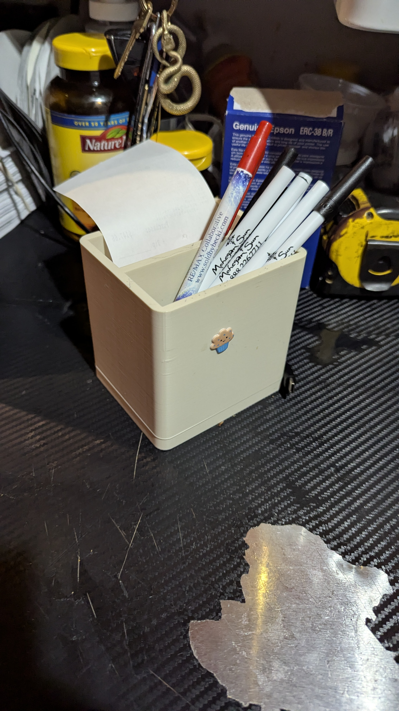
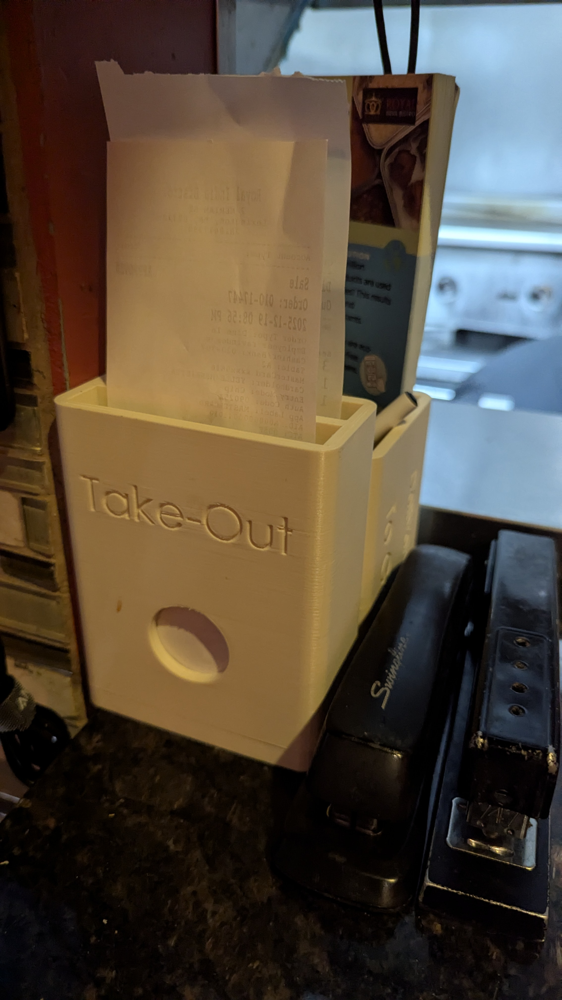
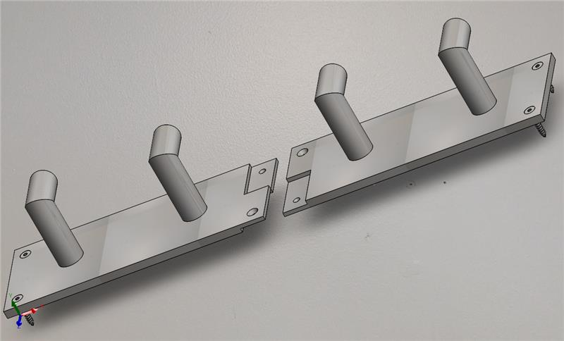
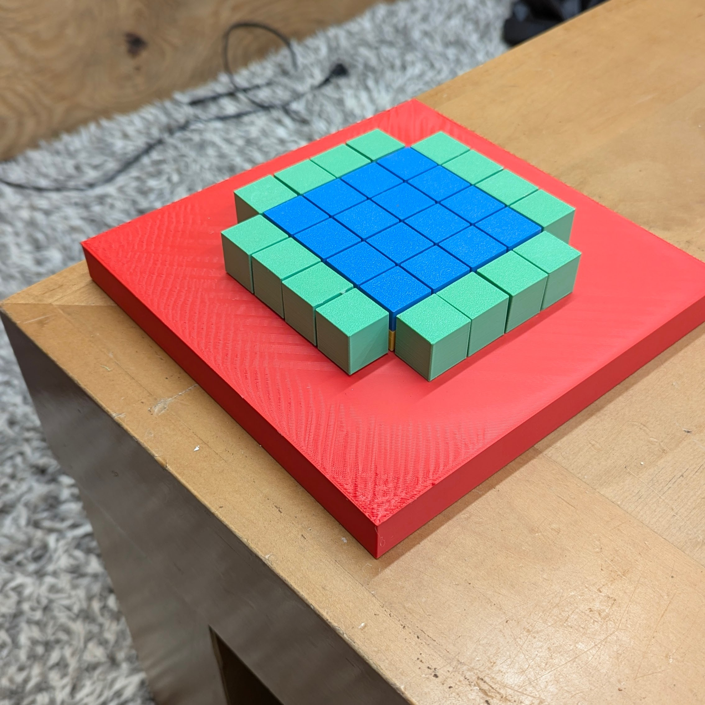
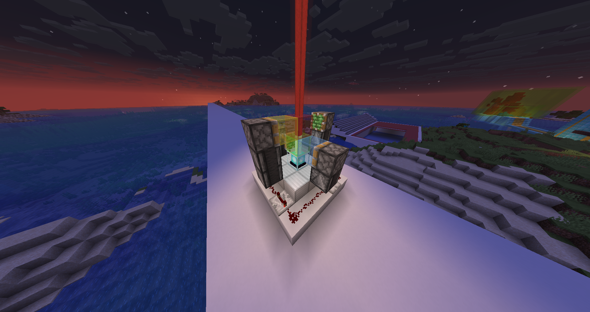

## About

Hi! My name is Daniel Olofsson. I am a junior at Minmuteman Vocational High School in Massachusetts studying Engineering. In my free time, I like solving Rubik's cube (18.8s), playing video games (Minecraft), playing volleyball, snowboarding, and using my Bambu 3D printer for solving small problems around my house.

## Projects

### Receipt & Pen Container (Nov 2025)

These two containers were designed to hold the pens and receipts at the restaurant I work at. The old containers did not support the receipts and pens enough. Many of the workers were new when I was designing the container and sometimes didn't know where each receipt went. I designed the new containers with a smaller width, greater height, a thumb hole, and text to describe what goes where.

blurb

blurb

### Tornado Lamp (Oct 2025)

The tornado lamp was a solo-project during my Junior year in Engineering. We had to design a part that could hold the electrical components inside. We had to design the part keeping in mind the battaries would have to be replaced in the future. I used threading to allow the top piece to screw onto the bottom one.

[Tornado Lamp Video](https://youtube.com/watch?v=NUYik51IP-0)

blurb

I tested the circuit I was going to use for the tornado lamp in order to ensure I would not burn out any LEDs from high voltages rushing through them. I split the circuit for the potentiometer to only affect the voltage going through the motor instead of the LEDs as well. The capacitor in the circuit helped smooth the transitions as the potentiometer changed how much voltage went through the motor and when the motor was suddenly turned on.

Part of the project included making drawings of the 3D-printed parts in the assemblies. For my parts, my reviewer was Rishi De Francesco. The drawings were mainly for practice since manufacturers would not be able to make either of the parts I created. These parts are not manufacturable because of how much would have to be taken out on the inside of the part.

In the assembly theere is a jar, switch, motor, potentiometer, and the two parts I modeled. You can see the motor if you go into wireframe mode because it is inside of the parts. I used this assembly to ensure everything would fit before I started to print the parts.

### Phone case (Oct 2025)

I had two phone cases prior to designing my new one. My previous phones did not have a flat back nor hold my driver's license. I printed my phone case in black TPU (Thermoplastic Polyurethane) to better resist falls and be easier to find in the snow.

In the first phone at the top right, you can see the sharp edges that mostly stayed until my fourth version. The fourth version was also the one that added a small cover on the camera. I changed from PLA to PLA silk for versions three to six. I printed my seventh model in TPU at my school before buying TPU to print the rest of the models. Since I was originally printing in PLA, which is a harder filament, my phone kept on falling out of the seventh model.

blurb

### Earbud Case Container (Sept 2025)

When my earbud case was in my pocket, I had to get up to put away my earbuds. I created this model to be able to access my earbud case while sitting down.

In the picture, I attached a carabiner to the container's hook and my belt loop on my pants.

I went through three versions for the container. The main problem were tolerances between the inside walls so the earbud case would not fall out of my container.

### Coat hanger (Jul 2025)

I needed a coat hanger for my wall since I have very limited space in my closet. Before the coat hanger, I would always throw my sweaters into a clump on my dresser. The coat hanger allowed me to easily find the sweater I wanted to wear at the time.

I used wood screws to connect the coat hanger pieces to the wall. I had to find two studs in my wall in order to know how far away the holes would have to be on.

I developed two versions for how the two pieces would connect together. The first design used interlocking teeth that would let the pieces angle away from the wall. The second design used two offset tabs at the end of each piece to connect to each other and stop from angling away from the wall. Just in case, I also added two screws in the center to make sure the tabs would stay connected.

### Marble roller coaster (May 2025)

This was a two-person Engineering assignment. Groups had to come up with a way to make an infinite loop for marbles. The infinite loop had to be powered by a simple electronic circuit. Each project needed to have at least two 3D-printed parts. Although some groups only printed parts, mine used cardboard since it was made changing the ramp heights, lengths, etc easy and fast.

[Marble Roller Coaster Video](https://youtu.be/Pt2sZilWaAs)

In the video, the marbles enter at the bottom right of the wheel, go up, and leave at the top to land on the cardboard ramp. My group had to add two cardboard extensions near the wheel. One carboard stop was added at the bottom so the marble would not go halfway into the slot and jump out as the wheel turned. The cardboard extension at the top marbles would not fall through the gap between the ramp and wheel in case they stayed on the wheel for a little longer than expected.

The wheel was developed through four prototypes. The first two were extremely large, so they had to be split up into four pieces during printing. Another problem I encountered were marbles leaving the slots they entered to early. I fixed this problem by adding a slant on the outer and inside of the edge to keep the marbles in at the bottom, and force them out at the top.

### Chiplet mockup (May 2025)

I worked on a chiplet assembly to print as a model for ZERO ASIIC. The model shows customers what the chips will look like. The small box-like pieces with pegs replicate the small chips that will be used to make a full chip. The pieces had to have just the right tolerances in order to stay inside of the plates but also be easily removable.

For the digital assembly, I used Onshape to create the parts. At the time, I was best at using OnShape. for the large block with four holes, I duplicated the smaller one to design quickly with minimal error. Similarly, I also duplicated the larger base to make the smaller one.

When printing the parts, I had to choose bright classic colors (Red, Green, Yellow, and Blue). I printed only one of each part before printing all of them in case the clearances were off. When I assembled the pieces, the large brick with the four pegs were not aligned with the base plate, so I had to change the distance betwwen each peg before printing the rest.

### Water spout holder (Dec 2024)

At my job, the water spout was getting jammed when between the two pieces of wood, and would keep flowing water after taking the pitcher away. On the left of the picture are the two pieces of wood. The water spout was very inconvenient to pick up when it was disconnected. This was one of my first projects outside of my engineering classroom, so my clearances were a little off.

### Beeswarm macro automation (2018)

When I was 10, I used to love playing a video game called Bee Swarm Simulator. This game required a lot of playing in order to progress. I decided that I could collect a lot of items and the game's currency by making a simple script to keep my character in the game collecting a little. At the time when I made the macro, almost no one used macros. A few years later, more than half of players online at any given time were using advanced macros to play the game for them due to how much time had to be put into the game.

### Minecraft redstone Fun (2016)

When I was about 8 years old, I was very interested in minecraft redstone. I followed many online tutorials and tried to design my own things as well. Additioanlly, I tried to adjust the redstone to make the building around it look better.

This redstone design uses a comparator to measure the angle the sword in the item frame is at. Based on the angle of the sword, the comparator sends out a stronger different redstone signal. As the signal increases, it can reach more of the sticky pistons to activate them and extend outwards forming stairs. When the sword is back to its upright position, the comparator signal resets to zero. The stairs are able to hide in the wall because they turn into corner stairs by connecting the the wall made of stairs perpendicular to the ones that are pushed out.

The first elevator image is inside a building I made. I had to adjust the slime blocks to only take the blocks I wanted up to the next floor. I created the button system on the bottom floor. The second image is a recent recreation to better show the redstone I used. I used an observer at the bottom to see the trapdoor flipped by the button. The two pistons then extend upwards. The slime bocks bring the sticky piston and observer up, and then only the sticky pistons retract. The observer at the top sees a new block of air and tells the sticky piston below to bring the 4 blocks below it up one block. Then the cycle repeats itself and the bottom observer sees a new air block and tells the two sticky pistons to push upwards.

The colored beacon swaps between five different colors: red, green, blue, yellow, and white. The image above is a recent recreation I did because my original 2 beacons were hidden under builds. The redstone would go in loop around the beacon. Each time the redstone was activated, the observer would tell the sticky piston above it to push out a block, but if it couldn't it would instead bring a block back. The redstone would have a single pulse at one of the restone dust sections. The pulse would activate the redstone repeater, and turn on the next section 0.2 seconds after while also turning off the previous section.