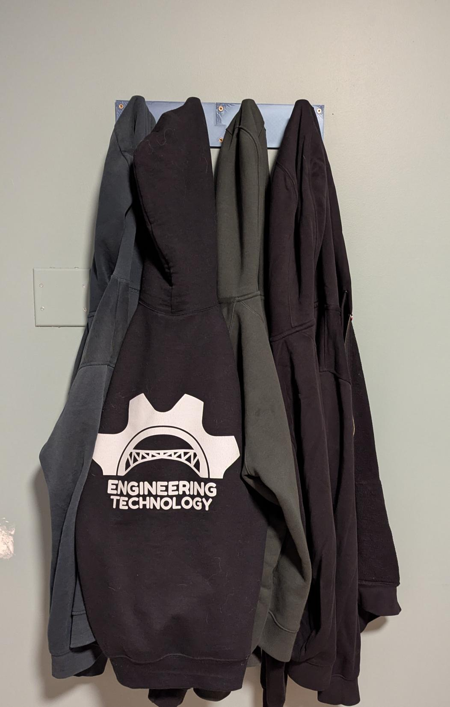

## About

Hi! My name is Daniel Olofsson. I am a junior at Minuteman Vocational High School in Massachusetts studying engineering, graduating June of 2027. In my free time, I like solving Rubik's cubes (18.8s), playing video games (Minecraft), playing volleyball, snowboarding, and using my Bambu 3D printer for solving problems. I am also a waiter at Royal Indian Bistro most weekends.

## Projects

### Receipt & Pen Container (Nov 2025)

At the restaurant, we had two metal boxes to hold pens and receipts. The problem was that they weren't big enough, weren't labeled, and would sometimes tip over. I designed and printed two new containers with smaller width, greater height, a thumb hole, and text to describe what goes where.

The container with the pens had to be tall enough and heavy enough so the container would not fall over and the pens would not fall out.

This container needed a small width with low clearances between the receipts and side of the container along with a tall height for the receipts to not fall out.

### Tornado Lamp (Oct 2025)

The tornado lamp was a solo project done during my junior year in engineering. We had to design a part that could hold the electrical components inside, keeping in mind that batteries would have to be replaced in the future. I used threading to allow the top piece to screw onto the bottom one. The tornado lamp used a potentiometer to control the speed of the motor which spun two magnets in a circle beneath the jar. Inside the jar, there is another magnet which creates the tornado when spun. As the speed of the motor increases, the tornado is pulled down further towards the bottom of the jar.

[Tornado Lamp Video](https://youtube.com/watch?v=NUYik51IP-0)

I tested the circuit I was going to use for the tornado lamp in order to ensure I would not burn out any LEDs from high voltages rushing through them. I split the circuit for the potentiometer to only affect the voltage going through the motor instead of the LEDs as well. The capacitor in the circuit helped smooth the transitions as the potentiometer changed how much voltage went through the motor and when the motor was suddenly turned on.

In the assembly there is a jar, switch, motor, potentiometer, and the two parts I modeled. You can see the motor if you go into wireframe mode because it is inside of the parts. I used this assembly to ensure everything would fit before I started to print the parts.

### Phone Case (Oct 2025)

I had purchased two phone cases for my Pixel 7 prior to designing my own. I didn't really like either of the store-bought cases because they did not have a flat back and could not hold my driver's license. I really cared about getting this right and ended up designing and printing ten different versions of the case before I was happy. 

The first three phones at the top left were printed using PLA and were OK, but had sharp (ugly) edges. The fourth version added a small cover around the camera to make the back smoother. I experimented with Bambu's PLA silk for versions three to six to make the case more flexible, but it didn't work out. To make the case more flexible and more durable, I started printing using TPU (Thermoplastic Polyurethane). My first TPU print (7th model) failed because the flexibility caused the phone to keep falling out of the case. PLA being more rigid needed more clearance between the case and the phone. The final case I printed in black TPU to better resist falls and be easier to find in the snow. For the final version of the phone case model, I only made a few small changes such as fixing the placement of the buttons and holes for the speaker and USB type C port.

### Earbud Case Container (Sept 2025)

Whenever my earbud case was in my pocket, I had to stand up to put away my earbuds (which was annoying). To access my earbuds while sitting down, I created this model. I went through three versions for the container. The main challenges were designing the tight clearances between the inside walls so the earbud case would not fall out of my container.

In the picture, I attached a carabiner to the container's hook and my belt loop on my pants.

### Coat Hanger (Jul 2025)

I needed a coat hanger for my wall since I have very limited space in my closet. Before the coat hanger, I would always throw my sweaters in a pile on my dresser. The coat hanger allowed me to easily find the sweater I wanted to wear at the time.

I developed two versions for how the two pieces would connect together. The first design used interlocking teeth that would let the pieces angle away from the wall. The second design used two offset tabs at the end of each piece to connect to each other and stop from angling away from the wall. Just in case, I also added two screws in the center to make sure the tabs would stay connected.

### Marble Roller Coaster (May 2025)

This was a two-person engineering assignment. Groups had to come up with a way to make an infinite loop for marbles. The infinite loop had to be powered by a simple electronic circuit. Each project needed to have at least two 3D-printed parts. Although some groups only printed parts, mine used cardboard since it was made changing the ramp heights, lengths, etc. easy and fast.

In the video, the marbles enter at the bottom right of the wheel, go up, and leave at the top to land on the cardboard ramp. My group had to add two cardboard extensions near the wheel. One cardboard stop was added at the bottom so the marble would not go halfway into the slot and jump out as the wheel turned. The cardboard extension at the top stopped marbles from falling through the gap between the ramp and wheel in case they stayed on the wheel for a little longer than expected.

[Marble Roller Coaster Video](https://youtu.be/Pt2sZilWaAs)

The wheel was developed through four prototypes. The first two were extremely large, so they had to be split up into four pieces during printing. Another problem I encountered were marbles leaving the slots they entered too early. I fixed this problem by adding a slant on the further edge and the inner edge to keep the marbles in at the bottom and force them out at the top.

### Chiplet Mockup (May 2025)

I worked on a chiplet assembly to print as a model for Zero ASIC to help customers visualize what the chips will look like. The small box-like pieces with pegs replicate the small chips that will be used to make a full chip. The pieces had to have just the right tolerances in order to stay inside of the plates but also be easily removable.

For the digital assembly, I used Onshape to create the parts. At the time, I was best at using OnShape. For the large block with four holes, I duplicated the smaller one to design quickly with minimal error. Similarly, I also duplicated the larger base to make the smaller one.

When printing the parts, I choose bright classic colors (red, green, yellow, and blue) for effect. I printed only one of each part before printing all of them in case the clearances were off. When I assembled the pieces, the large brick with the four pegs was not aligned with the base plate, so I had to change the distance between each peg before printing the rest.

### Water Spout Holder (Dec 2024)

At my job, the water spout was getting jammed and water would keep flowing after taking the pitcher away. I measured, designed, and printed a new spout holder that would help with automatic shutoff. This was one of my first projects outside of my engineering classroom.

### Bee Swarm Simulator Macro Automation (2018)

When I was 10, I used to love playing a video game called Bee Swarm Simulator. This game required a lot of grinding to progress. I decided that I could collect a lot of items and the game's currency by making a simple script to keep my character in the game when I wasn't playing. At the time when I made the macro, almost no one used macros. A few years later, more than half of players online at any given time were using advanced macros to play the game for them due to how much time had to be put into progressing in the game.

### Minecraft Redstone Fun (2016)

When I was about 8 years old, I was very interested in Minecraft redstone. I followed many online tutorials and tried to design my own machines as well. Additionally, I tried to adjust the redstone to make the building around it look better.

This redstone design uses a comparator to measure the angle of the sword in the item frame. Based on the angle of the sword, the comparator sends out a stronger different redstone signal. As the signal increases, it can reach more of the sticky pistons to activate them and extend outwards forming stairs. When the sword is back to its upright position, the comparator signal resets to zero. The stairs are able to hide in the wall because they turn into corner stairs by connecting the wall made of stairs perpendicular to the ones that are pushed out.

The first elevator image is inside a building I made. I had to adjust the slime blocks to only take the blocks I wanted up to the next floor. I created the button system on the bottom floor. The second image is a recent recreation to better show the redstone I used. I used an observer at the bottom to see the trapdoor flipped by the button. The two pistons then extend upwards. The slime bocks bring the sticky piston and observer up, and then only the sticky pistons retract. The observer at the top sees a new block of air and tells the sticky piston below to bring the 4 blocks below it up one block. Then the cycle repeats itself and the bottom observer sees a new air block and tells the two sticky pistons to push upwards.

The colored beacon swaps between five different colors: red, green, blue, yellow, and white. The image above is a recent recreation I did because my original 2 beacons were hidden under builds. The redstone would go in loop around the beacon. Each time the redstone was activated, the observer would tell the sticky piston above it to push out a block, but if it couldn't it would instead bring a block back. The redstone would have a single pulse at one of the redstone dust sections. The pulse would activate the redstone repeater and turn on the next section 0.2 seconds after while also turning off the previous section.

