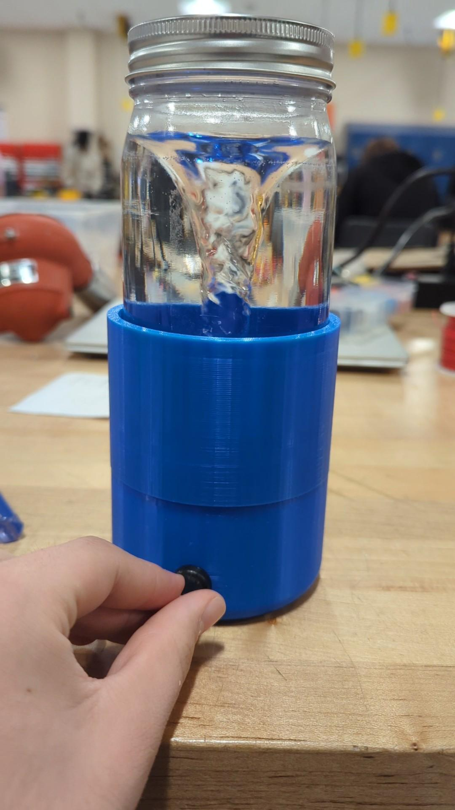
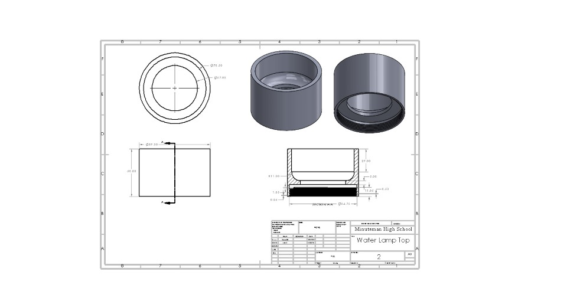
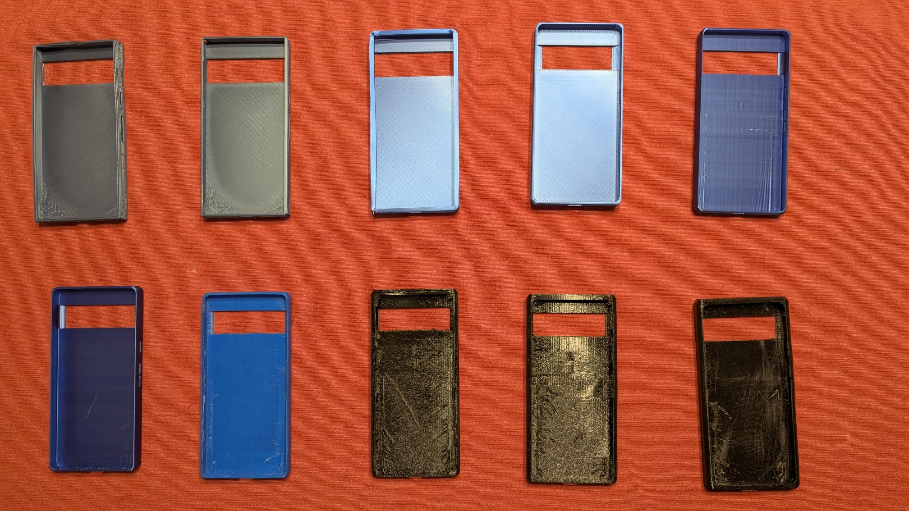
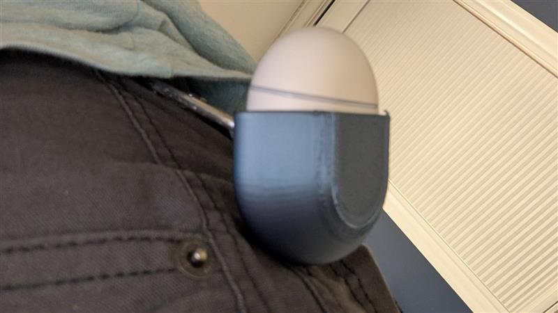
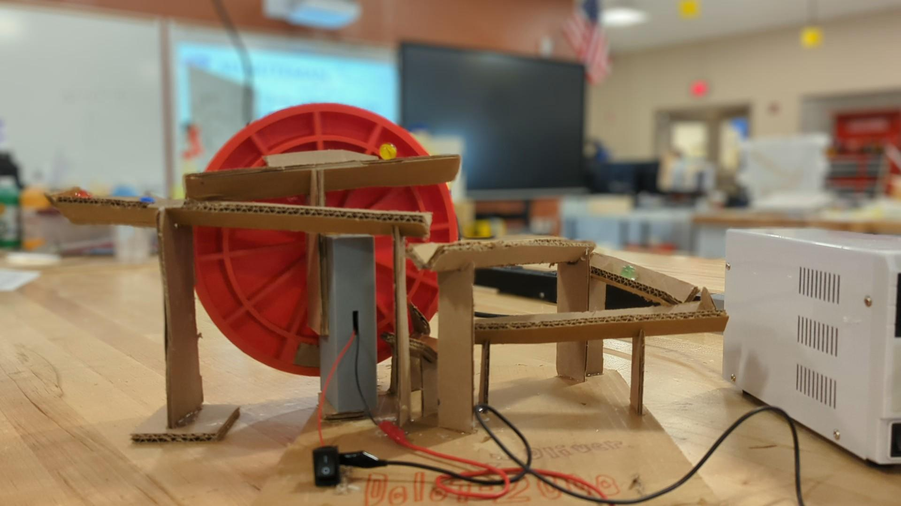
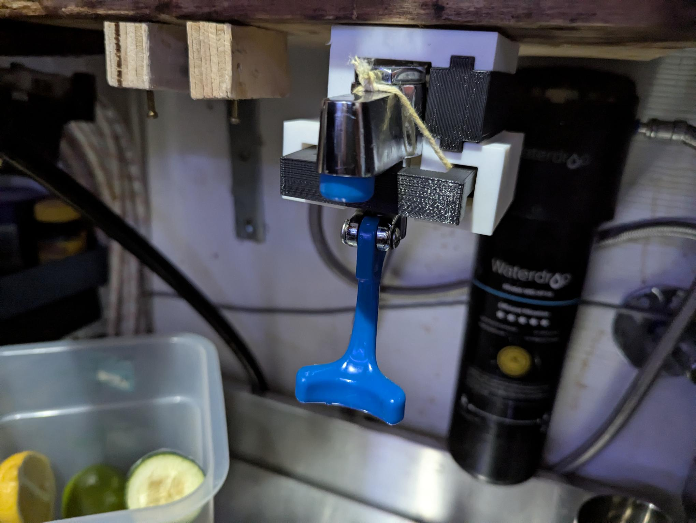
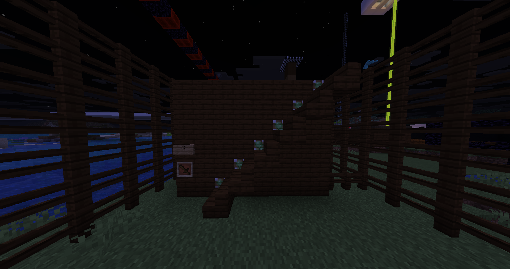
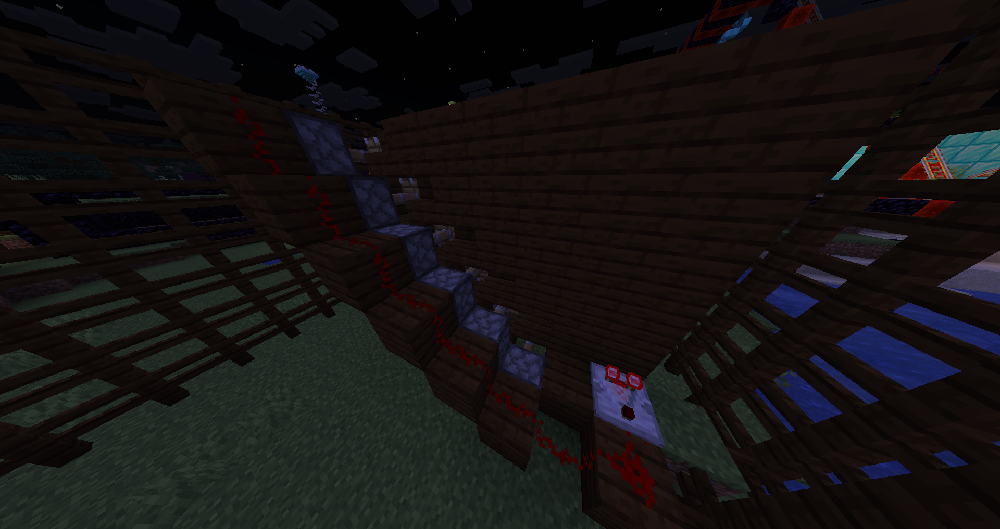
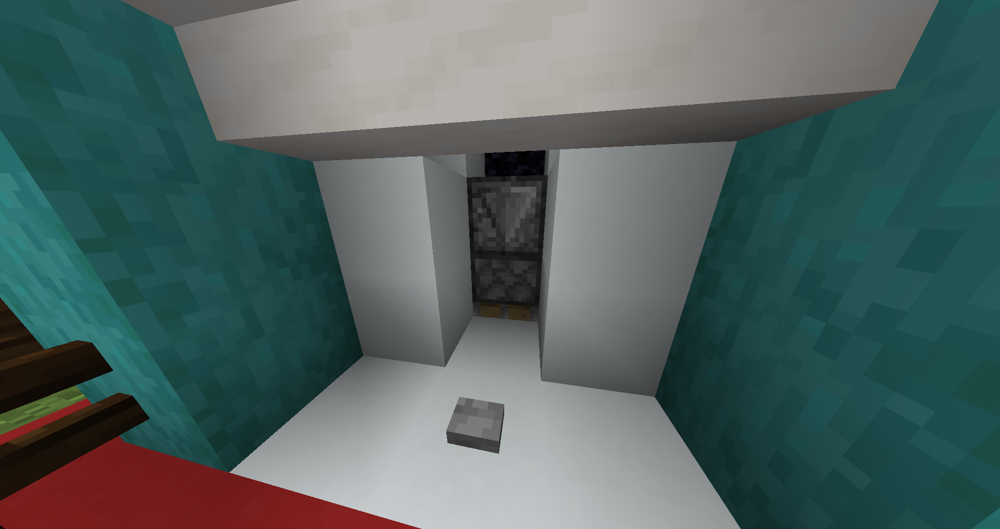
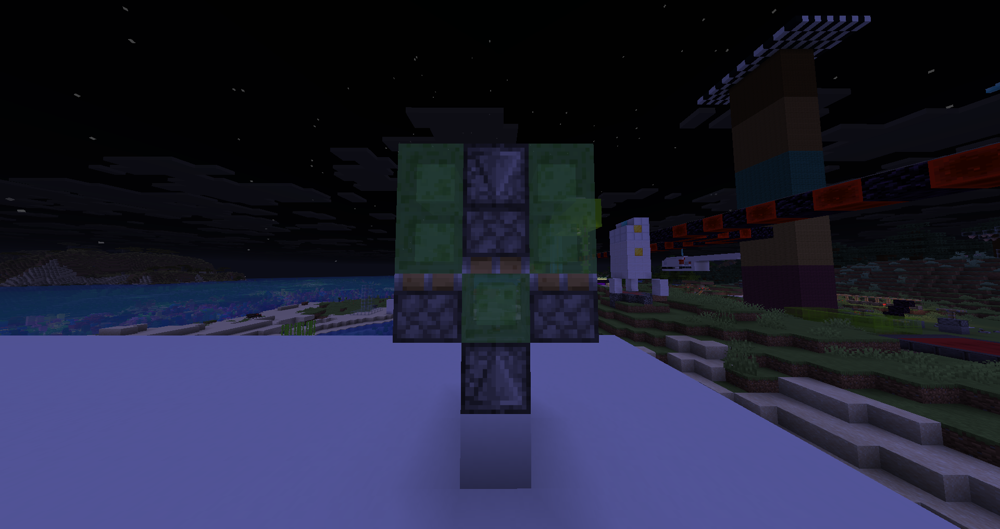

## About

Hi! My name is Daniel Olofsson. I am a junior at Minmuteman Vocational High School in Massachusetts studying Engineering. In my free time, I like solving Rubik's cube (18.8s), playing video games (Minecraft), playing volleyball, snowboarding, and using my Bambu 3D printer for solving small problems around my house.

## Projects

### Receipt & Pen Container (Nov 2025)

These two containers were designed to hold the pens and receipts at the restaurant I work at. The old containers did not support the receipts and pens enough. Many of the workers were new when I was designing the container and sometimes didn't know where each receipt went. I designed the new containers with a smaller width, greater height, a thumb hole, and text to describe what goes where.

### Tornado Lamp (Oct 2025)

The tornado lamp was a solo-project during my Junior year in Engineering. We had to design a part that could hold the electrical components inside. We had to design the part keeping in mind the battaries would have to be replaced in the future. I used threading to allow the top piece to screw onto the bottom one. 

<iframe width="560" height="315"
  src="https://www.youtube.com/shorts/NUYik51IP-0"
  frameborder="0"
  allow="accelerometer; autoplay; clipboard-write; encrypted-media; gyroscope; picture-in-picture; web-share"
  allowfullscreen>
</iframe>

### Phone case (Oct 2025)

I had two phone cases prior to designing my new one. My previous phones did not have a flat back nor hold my driver's license. I printed my phone case in black TPU (Thermoplastic Polyurethane) to better resist falls and be easier to find in the snow.

<iframe 
    src="https://github.com/dlolofsson/dlolofsson.github.io/blob/main/assets/models/Phone-Case-10.STL"
    width="600" 
    height="400"
    frameborder="0">
</iframe>

### Earbud key chain (Sept 2025)

When my earbud case was in my pocket, I had to get up to put away my earbuds. I created this model to be able to access my earbud case while sitting down.

<iframe 
    src="https://github.com/dlolofsson/dlolofsson.github.io/blob/main/assets/models/EarBudCase.STL"
    width="600" 
    height="400"
    frameborder="0">
</iframe>

### Coat hanger (Jul 2025)

I needed a coat hanger for my wall that would have screw holes where the studs were in my wall.

### Marble roller coaster (May 2025)

This was a two-person Engineering assisbnent. Groups had to come up with a way to make an infinite loop for marbles. Each project needed to have at least 2 3D-printed parts.

<iframe width="560" height="315"
  src="https://youtube.com/watch?v=Pt2sZilWaAs"
  frameborder="0"
  allow="accelerometer; autoplay; clipboard-write; encrypted-media; gyroscope; picture-in-picture; web-share"
  allowfullscreen>
</iframe>

### Chiplet mockup (May 2025)

I worked on a chiplet assembly to print as a model for ZERO ASIIC. The model is supposed to show customers what the chips will look like.

assembly

For the digital assembly, I used Onshape to create the parts.

assembly (pic)

When printing the parts, I had to choose bright classic colors (Red, Green, Yellow, and Blue). I printed only one of each part before printing all of them in case the clearances were off.

### Water spout holder (Dec 2024)

At my job, the water spout was getting jammed when between the two pieces of wood, and would keep flowing water after taking the pitcher away. The water spout was very inconvenient to pick up when it was disconnected.

### Beeswarm macro automation (2018)

When I was 10, I used to love playing a video game called Bee Swarm Simulator. This game required a lot of playing in order to progress. I decided that I could collect a lot of items and the game's currency by making a simple script to keep my character in the game collecting a little. At the time when I made the macro, almost no one used macros. A few years later, more than half of players online at any given time were using advanced macros to play the game for them due to how much time had to be put into the game.

### Minecraft redstone Fun (2016)

When I was about 8 years old, I was very interested in minecraft redstone. I followed many online tutorials and tried to design my own things as well. Additioanlly, I tried to adjust the redstone to make the building around it look better.

blurb

blurb

blurb